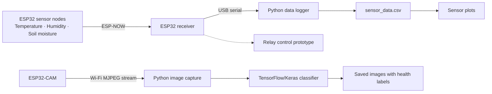
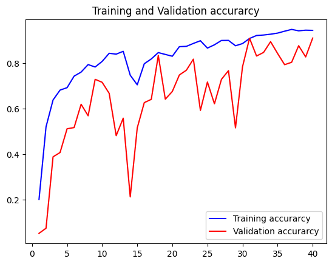
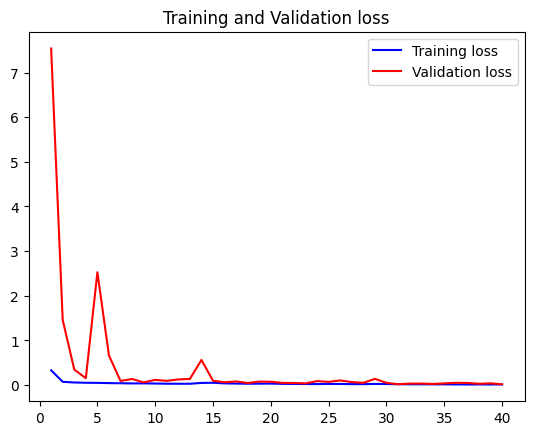

# 🌿 Aventus Autoflora

**Wireless plant monitoring, camera streaming, and image-based plant health classification.**

Aventus Autoflora brings together ESP32 sensor nodes, an ESP32-CAM, and Python tools to monitor growing conditions and explore plant disease detection. Sensor readings travel wirelessly to a receiver, while a separate camera provides images for a TensorFlow/Keras classification workflow.

> **Project status:** Hardware and software prototype. This repository contains the individual firmware, logging, visualization, and machine learning components; the desktop interface and irrigation integration still need work.

## 🎬 Demo Video

[](https://www.youtube.com/watch?v=mknOZel5K7s)

[▶ Watch the Aventus Autoflora demo on YouTube](https://www.youtube.com/watch?v=mknOZel5K7s)

## What’s Included

- **Wireless sensor nodes:** ESP32 boards read temperature, humidity, and soil moisture, then transmit readings using ESP-NOW.
- **Central receiver:** Collects readings from up to three sender IDs and outputs them over USB serial.
- **CSV data logging:** A Python script records measurements with timestamps for later analysis.
- **Camera streaming:** ESP32-CAM firmware serves an MJPEG video stream over the local Wi-Fi network.
- **Plant health classification:** Python scripts resize captured images to 256 × 256 pixels and run predictions using a saved TensorFlow/Keras model.
- **Visualization and interface experiments:** Sensor plotting tools, training charts, and a Tkinter desktop interface prototype.
- **Irrigation control prototype:** Receiver firmware includes relay output logic for soil moisture control.

## How It Works



The sensor network uses ESP-NOW for board-to-board communication. The camera connects to a Wi-Fi network, and a computer runs the logging and image analysis tools.

## Hardware

| Component | Purpose |
| --- | --- |
| ESP32 sender board(s) | Read sensors and transmit measurements |
| ESP32 receiver board | Receive readings and provide USB serial output |
| DHT11 sensor | Measure temperature and humidity |
| Capacitive soil moisture sensor | Measure soil moisture through an analog input |
| ESP32-CAM | Stream images; the sketch selects the AI Thinker model |
| Relay module | Output for the irrigation control prototype |
| Computer with USB and Wi-Fi | Run Python tools and access the camera stream |

### Pins Used in the Current Sketches

| Board | Connection | GPIO |
| --- | --- | --- |
| Sender | DHT11 data | 23 |
| Sender | Soil moisture analog input | 34 |
| Receiver | Relay output | 23 |

Adjust the pin definitions to match your wiring. Calibrate the soil moisture conversion for your sensor: the current sender maps analog values from `0–200` to `0–100`, which is a prototype mapping rather than a universal moisture percentage.

## Repository Guide

| File or folder | Purpose |
| --- | --- |
| [SenderBoard_Code/](SenderBoard_Code/) | Sensor readings and ESP-NOW transmission |
| [RecieverBoard_Code/](RecieverBoard_Code/) | ESP-NOW receiver and relay control prototype |
| [Receiver_Board_MAC_Address/](Receiver_Board_MAC_Address/) | Helper sketch for obtaining the receiver’s MAC address |
| [Video_Streaming_Web_Server_Code/](Video_Streaming_Web_Server_Code/) | ESP32-CAM MJPEG streaming server |
| [serialdatalogger.py](serialdatalogger.py) | Serial readings to timestamped CSV rows |
| [heatmap.py](heatmap.py) | Line plots of temperature, humidity, and soil moisture |
| [esp32camphotosaver.py](esp32camphotosaver.py) | Camera image capture and health-label filenames |
| [disease_predictor.py](disease_predictor.py) | Load the saved model and classify an image |
| [Plant Disease Classification.ipynb](Plant%20Disease%20Classification.ipynb) | Plant disease classification notebook |
| [plant_disease_label_transform.pkl](plant_disease_label_transform.pkl) | Label transformation used by the classifier |
| [Final_GUI.py](Final_GUI.py) | Tkinter desktop interface prototype |
| [sensor_data.csv](sensor_data.csv) | Existing sensor data |
| [RunDataLogger.bat](RunDataLogger.bat) | Windows launcher; adapt its paths before use |

## Getting Started

### 1. Download the Project

```bash
git clone https://github.com/FaizanTabassum/Aventus_autoflora.git
cd Aventus_autoflora
```

### 2. Set Up the ESP32 Sensor Network

1. Install Arduino IDE, the ESP32 board support package, and the DHT sensor library with its required dependencies.
2. Upload the MAC address helper sketch to the receiver and note its station MAC address.
3. Set `broadcastAddress` in the sender sketch to that receiver MAC address.
4. Set the sensor pins and `DHTTYPE` to match your hardware.
5. Assign each sender a unique `myData.id` between **1 and 3**. The current receiver allocates three slots.
6. Upload the receiver sketch and sender sketch(s).
7. Open the receiver’s Serial Monitor at **115200 baud** and check that board IDs and readings arrive.

Both sender and receiver must use the same message structure and a compatible radio channel. The sketches use ESP-NOW callback signatures from an older ESP32 Arduino API; newer board package versions may require adapting those signatures.

### 3. Configure the Camera

1. Open the camera streaming sketch.
2. Replace `ssid` and `password` with your Wi-Fi network details.
3. Select the camera model and Arduino board settings that match your hardware.
4. Upload the sketch and open the Serial Monitor at **115200 baud**.
5. Open the printed `http://<camera-ip>/` address from a computer on the same network.

The current sketch serves the MJPEG stream at `/` on port **80**.

### 4. Prepare the Python Environment

Create and activate a virtual environment:

```bash
python -m venv .venv
```

On Windows:

```powershell
.venv\Scripts\Activate.ps1
```

On macOS or Linux:

```bash
source .venv/bin/activate
```

Install the packages used by the scripts:

```bash
python -m pip install pyserial numpy opencv-python matplotlib Pillow scikit-learn tensorflow jupyter
```

The machine learning files use older Keras import paths and a directory-based saved model. Package versions are not pinned in this repository, so use a TensorFlow/Keras environment compatible with the model and imports, or update them together. Tkinter is also required for the GUI prototype and may need a separate installation depending on your Python distribution.

### 5. Log Sensor Readings

Set `serial_port` in `serialdatalogger.py` to the receiver’s port. The current default is `COM3`; macOS and Linux use different device paths.

Close the Arduino Serial Monitor before starting the logger, then run:

```bash
python serialdatalogger.py
```

Readings are appended to `sensor_data.csv` with these fields:

```text
board_id,humidity,temperature,soil_moisture,timestamp
```

Press **Ctrl+C** to stop logging and close the serial connection.

### 6. Configure Image Classification

The trained model is **not included in the repository**. Provide a compatible saved model and use the matching label transformation file, or develop the training workflow in the notebook.

Before running image capture:

- Set `model_path` in `disease_predictor.py` to your saved model.
- Set `save_folder` in `esp32camphotosaver.py` to an existing local directory.
- Update the actual `stream_url` inside `capture_photo()` to your camera address. The separate IP variables at the top are not currently used by that function.
- Check that `healthy_classes` matches your model’s class ordering.

```bash
python esp32camphotosaver.py
```

The script attempts a single capture and saves a classified image with a timestamp and a healthy/unhealthy label. Continuous capture requires extending the stream-reading loop.

## Training Charts

The repository includes these training plots:

| Accuracy | Loss |
| --- | --- |
|  |  |

## Current Limitations

These details matter when reproducing the prototype:

- **Irrigation integration:** Incoming readings update `boardsStruct`, but the relay loop reads the separate `board1` object. Connect the relay logic to the received readings and verify thresholds and relay polarity before relying on automatic watering.
- **Desktop GUI:** `Final_GUI.py` contains unfinished callbacks, missing imports, and placeholder graph and disease-detection code. It is a development reference rather than a ready-to-run dashboard.
- **Plot timestamps:** The logger writes `YYYY/MM/DD HH:MM`, while `heatmap.py` expects `DD-MM-YYYY HH:MM`. Align the formats and update the CSV path before plotting.
- **Local configuration:** Several scripts contain machine-specific Windows paths and fixed camera addresses. Replace them with your own.
- **Model assets:** The original README mentioned a Drive folder for photos and saved models, but no URL was supplied. A download link still needs to be added.
- **Reproducibility:** The repository does not include pinned Python dependencies or a documented model runtime.

## Contributing

Ideas, fixes, and improvements are welcome. Useful next steps include completing the GUI, correcting relay data flow, improving camera capture, and making configuration and model setup easier to reproduce.

Open an issue to discuss a change, or submit a pull request with a clear description of what it improves.
